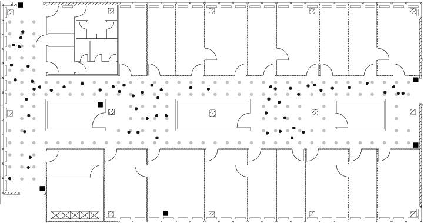

```{r , include=FALSE}
knitr::opts_chunk$set(echo = TRUE, warning = FALSE)
```
# Introduction 

We want to know if it is possible to accurately determine position on the floor of a building using a mobile device to measure signal strength from various access points. Researchers at the University of Mannheim created a dataset for this purpose. The dataset was created by standing at certain locations, holding a device at certain orientations, and repeatedly measuring signal strength to several access points. The floor plan is shown below [1]:



There are a total of 166 locations, spaced one meter apart. The researchers held the device at 8 different orientations, in increments of 45 degrees. For each combination of location and orientation, the researchers recorded 110 measurements to each of 6 access points.

# Data Preparation

In order to start training models to predict location of a device, first we needed to get our data into a usable form. We first read the entire `offline.final.trace.txt` file into a character variable called `txt`.

```{r}
source("case_study_functions.R", echo = T, prompt.echo = "", spaced = F)
offline_file_path = "data/offline.final.trace.txt"
txt = readLines(offline_file_path)
length(txt)
```

We have 151392 total lines in our `txt` variable. The first few lines look like this:

```{r}
txt[1:4]
```

We now see that there are lines beginning in # that do not contain actual data, so we will discard them. Additionally, each record is all on one line in a format that we will have to parse. We split each line at the euqal signs, semicolons, and commas and picked out the data by position. Since each line contained information about the device as well as the access points, we opted to store each device-access point combination as its own line. To do this, we replicated the device information (time, MAC address, position) and appended it to the information about each access point. We repeated this process for each line and combined them all into one data frame with appropriate column names. Since all our variables were still characters, we converted numerical variables to the numeric class and our time variable to the POSIXct class, after converting time from milliseconds to seconds.

We found that the type column contained both adhoc devices and access point devices. Since we only planned to use signal strengths from access points in our model, we discarded records of adhoc devices and deleted the type column. We found that scanMac and posZ only had one unique value each, and deleted those columns too. We found that there were angle values that were not exact multiples of 45 as expected. We rounded angle to the nearest 45 degrees to account for this, also setting values of 360 to be 0 since they are equivalent. We found that there were more access point MAC addresses than expected. Upon further inspection, it appeared that some access points were outside of the floor plan (possibly on other floors) since they had far fewer observations than expected, and these were removed. There also appeared to be two MAC addresses ending in c0 and cd in the same location, i.e., for the same access point. We left both of these in and will examine this in a later section. Lastly, we found there was a one-to-one correspondence between MAC address and channel, so we removed the channel column. All of this data preparation is handled by the function `readData`, which can be found in `case_study_functions.R`.

```{r}
offline = readData(offline_file_path)
```

We have many measurements of signal strength for each combination of location, orientation, and MAC address. Since we intended to use a k-nearest neighbor method to predict position of a new record of measurements, we thought measurments at the same position would take up most or all of each "neighborhood", causing the model to only predict locations at the training set grid points. For this reason, we decided to summarize each location-orientation-MAC combination by taking the mean, median, standard deviation, and interquartile range of signal strengths at each combination. This way, we can use the summarized positions in the training set as our neighbors rather than the individual measurements. This is handled by the function `createSummary`.

```{r}
offlineSummary = createSummary(offline)
```

We found that angle of the device has a significant impact on signal strengths to the various access points. To account for this, we will select rows in `offlineSummary` with either the same angle or the m closest angles to compare to new observations in our online test data set. We then reshape our data into a data frame where each row consists of position of the device and average signal strenghts to each of the 7 MAC addresses. This will allow us to compare vectors of signal strengths by measuring Euclidean distance between our offline records and an online record. This functionality is handled by the functions `selectTrain` and `reshapeSS`.

We take similar steps in preparing the online test data. However, each position in the online data is only measured at one angle, so we only need to group by location and MAC address when averaging signal strengths. We will use a simplified function called `createOnlineSummary` to summarize our online data.

# Modeling

We have now obtained vectors of signal strengths for both offline and online data. We will use a k-nearest neighbors approach to find the closest offline vectors to each online vector, and then take the average location of the offline records as our prediction for the location of the online record. We use Euclidean distance to determine closeness of vectors. We will use both a standard k-NN method taking the arithmetic mean and weighted k-NN method using a weighted average of locations. We use the following weight formula: $$\frac{1/d_i}{\sum_{i=1}^k 1/d_i}$$

`findNN` and `findNNWeight` find the nearest neighbors and the nearest neighbors with weights, respectively. We will calculate error by taking the average squared error between the true location and the predicted location, using the function `calcError`.

## Tuning k with cross-validation

Before testing our model on our online data, we use cross-validation to find the value of k that minimizes the ASE. We train on 10 folds and test values of k from 1 to 15. This is done using the function `run_kkross_fold`. We noted before that there were two MAC addresses, ending in c0 and cd, that appeared to be in the same location. We will find optimal k values for both standard and weighted k-NN excluding c0, excluding cd, and including both.

### Standard k-NN 10-fold cross-validation without c0

```{r}
set.seed(9001)
subMacs = names(sort(table(offline$mac), decreasing = TRUE))[1:7]
offlineSummary_without_c0 = subset(offlineSummary, mac != subMacs[1])
cv_without_c0 = run_kkross_fold(offlineSummary_without_c0)
plot(cv_without_c0, type="l", xlab="k value", ylab="Cross-validation ASE", 
     main = "Cross-validation results without c0")
```

The optimal value of k without c0 is 5, as determined by cross-validation.

### Standard k-NN 10-fold cross-validation without cd

```{r}
offlineSummary_without_cd = subset(offlineSummary, mac != subMacs[2])
cv_without_cd = run_kkross_fold(offlineSummary_without_cd)
plot(cv_without_cd, type="l", xlab="k value", ylab="Cross-validation ASE", 
     main = "Cross-validation results without cd")
```

The optimal value of k without cd is 8.

### Standard k-NN 10-fold cross-validation with both c0 and cd

```{r}
cv_both = run_kkross_fold(offlineSummary)
plot(cv_both, type="l", xlab="k value", ylab="Cross-validation ASE", 
     main = "Cross-validation results with both c0 and cd")
```

The optimal value of k with both c0 and cd is 5.

### Weighted k-NN 10-fold cross-validation without c0

```{r}
cv_without_c0_weighted = run_kkross_fold_weighted(offlineSummary_without_c0)
plot(cv_without_c0_weighted, type="l", xlab="k value", ylab="Cross-validation ASE", 
     main = "Cross-validation results without c0")
```

The optimal value of k without c0 is 7.

### Weighted k-NN 10-fold cross-validation without cd

```{r}
cv_without_cd_weighted = run_kkross_fold_weighted(offlineSummary_without_cd)
plot(cv_without_cd, type="l", xlab="k value", ylab="Cross-validation ASE", 
     main = "Cross-validation results without cd")
```

The optimal value of k without cd is 8.

### Weighted k-NN 10-fold cross-validation with both c0 and cd

```{r}
cv_both_weighted = run_kkross_fold_weighted(offlineSummary)
plot(cv_both, type="l", xlab="k value", ylab="Cross-validation ASE", 
     main = "Cross-validation results with both c0 and cd")
```

The optimal value of k with both c0 and cd is 5.


## Predicting location in online data

We will test models for both our standard and weighted methods excluding c0, excluding cd, and including both.

### Standard k-NN with both c0 and cd

```{r}
macs = unique(offlineSummary$mac)
online = readData(online_file_path, subMacs = macs)
onlineSummary = createOnlineSummary(online)
actualXY = onlineSummary[ , c("posX", "posY")]
predicted_locations = predict_online_locations(offlineSummary,onlineSummary,k=5)

train_points = unique(cbind(offlineSummary$posX, offlineSummary$posY))
plot_predicted_locations(predicted_locations, actualXY, train_points)

paste("Test ASE:", calcError(predicted_locations,actualXY))
```

The plot shows the predicted positions in black, the actual points in red, and the training set points in gray. Errors are shown by red lines connecting the predicted and actual points.

### Standard k-NN without c0


```{r}
onlineSummary_without_c0 <- onlineSummary[,-7]
predicted_locations = predict_online_locations(offlineSummary_without_c0,onlineSummary_without_c0,k=5)

plot_predicted_locations(predicted_locations, actualXY, train_points)

paste("Test ASE:", calcError(predicted_locations,actualXY))
```


### Standard k-NN without cd 


```{r}
onlineSummary_without_cd <- onlineSummary[,-6]
predicted_locations = predict_online_locations(offlineSummary_without_cd,onlineSummary_without_cd,k=8)

plot_predicted_locations(predicted_locations, actualXY, train_points)

paste("Test ASE:", calcError(predicted_locations,actualXY))
```


### Weighted k-NN with both c0 and cd

```{r}
predicted_locations= predict_online_locations_weighted(offlineSummary, onlineSummary, k=5)

plot_predicted_locations(predicted_locations, actualXY, train_points)

paste("Test ASE:", calcError(predicted_locations,actualXY))
```


### Weighted k-NN without C0

```{r}
predicted_locations= predict_online_locations_weighted(offlineSummary_without_c0, onlineSummary_without_c0, k=7)

plot_predicted_locations(predicted_locations, actualXY, train_points)

paste("Test ASE:", calcError(predicted_locations,actualXY))
```

### Weighted k-NN without cd

```{r}
predicted_locations = predict_online_locations_weighted(offlineSummary_without_cd, onlineSummary_without_cd, k=8)

plot_predicted_locations(predicted_locations, actualXY, train_points)

paste("Test ASE:", calcError(predicted_locations,actualXY))
```

# Results

We found that weighted k-NN without c0 had the best fit on the test data, with a test ASE of 4.139. This model found the closest 7 neighbors to each online record in terms of Euclidean distance and took a weighted average of their position. Examining the plot for this model shows that most of our predictions are very close, and the ones with the higest error are still in the same general area of the hall. This shows that this could be a reasonably useful model in determining the location of a device on this floor.

# Drawbacks

One significant drawback of this method is that signal strength can be highly dependent on device. For example, different Wi-Fi chips may be stonger or weaker, or pick up different signals differently. A few possible solutions to this could be to standardize, scale, or rank the data so that inputs are dependent only on signal strength in relation to other signal strengths for the same device.

Another drawback is that k-NN is a nonparametric method and makes no attempt to find meaning in the actual values of signal strengths. Since we expect signal strength to be correlated with distance from the access point, a parametric model like linear regression may be able to take advantage of this and perform better.

Third, we did not assume any dependency between variables in this model. If we were moving around the room, we would expect some signal strengths to generally move up and down together, while others would move up and down at opposite times. A more complex model may be able to account for this potential dependency between variables and generate more accurate predictions.

# References

[1] D. Nolan and D. T. Lang, "Predicting Location via Indoor Positioning Systems," in *Data Science in R: A Case Studies Approach to Computational Reasoning and Problem Solving*, Boca Raton, FL, USA: CRC Press, 2015, ch. 1, pp. 3-43.