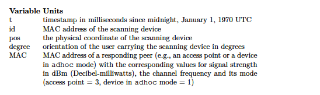

```{r setup, include=FALSE}
knitr::opts_chunk$set(echo = TRUE)
```

## Introduction 

The case study is about the precition of handheld device location based on its signal strength 

The data is provided in followin format  : 


## QUESTIONS

### Using the OFFLINE data and two different clustering methods predict the location of the ONLINE data set. 

 
#### Solution :

We run two variants of knn. in One we predicted XY position by taking simple mean of X and Y positions of nearest neighbour and in other we calculated XY position by taking weighted average of the the XY positions of the nearest neighbours. 

weight formula used is :


where di is the distance from our new point to that nearest reference point (in signal strength space).

The prediction functions are implemented in method predXYWeighted for weighted prediction and predXY for simple average prediction.


### 1.	 Describe how you prepared the data.

#### Solution 

* The preparation step involves several steps. Starting from exploration of data. The data was presented as one observation per line per time stamp,per position and per Angel using different separators. For each combination of time , angle and location there were signical strenths from different macs that were observed.  Following is a typical structure for data 
[1] "t=1139643118358;id=00:02:2D:21:0F:33;pos=0.0,0.0,0.0;degree=0.0;00:14:bf:b1:97:8a=-38,2437000000,3;00:14:bf:b1:97:90=-56,2427000000,3;00:0f:a3:39:e1:c0=-53,2462000000,3;00:14:bf:b1:97:8d=-65,2442000000,3;00:14:bf:b1:97:81=-65,2422000000,3;00:14:bf:3b:c7:c6=-66,2432000000,3;00:0f:a3:39:dd:cd=-75,2412000000,3;00:0f:a3:39:e0:4b=-78,2462000000,3;00:0f:a3:39:e2:10=-87,2437000000,3;02:64:fb:68:52:e6=-88,2447000000,1;02:00:42:55:31:00=-84,2457000000,1"
As we can see here the time , angle , position  and mac signal details are semi colon separated. 

we get following structure if split by semicolon 

[1] "t=1139643118358"                    "id=00:02:2D:21:0F:33"              
 [3] "pos=0.0,0.0,0.0"                    "degree=0.0"                        
 [5] "00:14:bf:b1:97:8a=-38,2437000000,3" "00:14:bf:b1:97:90=-56,2427000000,3"
 [7] "00:0f:a3:39:e1:c0=-53,2462000000,3" "00:14:bf:b1:97:8d=-65,2442000000,3"
 [9] "00:14:bf:b1:97:81=-65,2422000000,3" "00:14:bf:3b:c7:c6=-66,2432000000,3"
[11] "00:0f:a3:39:dd:cd=-75,2412000000,3" "00:0f:a3:39:e0:4b=-78,2462000000,3"
[13] "00:0f:a3:39:e2:10=-87,2437000000,3" "02:64:fb:68:52:e6=-88,2447000000,1"
[15] "02:00:42:55:31:00=-84,2457000000,1"





here each record starting from label 5 each per mac record which is camma separated. first recorded of camma separated component is mac, signal pair second is component and third is type. 

We stored data in dataframe for each time stamp and mac address in a separate raw instead of storing all the mac ids in same raw as presented in the input data. One advantage of this approach is that we have fixed number of columns in our data set as opposed to the input data in which each line contains vsrying  number of mac addresses.
Disadvantage is that there is redundancy of timestamp values for each mac of same raw in input data. however we continued with this for simplicity of structure.  

our struncture cintains following columns 

c("time", "scanMac", "posX", "posY", "posZ",
"orientation", "mac", "signal",
"channel", "type"

during our analysis we found that   id , and channel variable are redundant and we retained only records that are corresponding to type 3 since type 1 were ad hoc mac addresses as mentioned in manual 

readData() method provided with the code performs this operation.


### 2.	Describe how you estimated your error and found the best fit ASSUMING you CANNOT USE THE ONLINE DATA.

#### Solution 

For model evaluation we calculated error between prediction positions and real positions in input data. We did it on ofline dataset by doing kfold cross validation to find optimal number of K wich number number of neighbours to consider while making our predictions using knn. The error calculated is the distance between predicted XY and the actual XY from the test data selected on each fold.

cross validations are implemented in function run_kkross_fold and error estimates is implemented in calcError function.

* Describe the best fit for the data (i.e. tables and/or charts with analysis)

#### Solution 

The best best fit for data we found was for k = 7 and error was close to 1600 as per the following graph. 


#### There are 2 macIDs located at the same position (the researchers used 00:0f:a3:39:e1:c0 and excluded 00:0f:a3:39:dd:cd for their analysis):


* Note: to effectively answer the below, you’d need to run (3) different scenarios (this aligns to question 9 from the text; page 41).


### 3.	Does one give better performance than the other? (compare the result of “c0” against “cd”)

### 4.	What about using them both? (compare the result of “c0 & cd” against “c0-only” and “cd-only”)


Taking a step-back; consider some recommendations:


### 5.	What is (are) the drawback(s) (if any of using this method to real-time locate an object)?

Few drawbacks we identified  strength can vary based on device (e.g. WiFi chip)
so a possible solution could be to standardize, scale, or rank signal strengths so it doesn't affect predictions too much
We also assumed that signals are independent and the presense of one device doesn;t affect other. There could be some relation between based on data and we can try to figure out possible correlation.
Euclidean distance might not be correct metric for predicting XY values.  We can use Manhattan Distance or others. 
We are using knn which is one of the simplest approach and neighbourhood based clusterning might not be most appropriate one,


### 6.	Describe a method that may be an improvement based on your perceived drawbacks.

We can use methods to handle each of the drawbacks identified above. 
Some data normalization and transformation can be done  to handle problem of varying signal strengthe of devices. 
We can also do some correlation analysis between different variable  to find any data dependence . 
Different distance functions can be used to analyse the impact of metric. We can use Manhattan Distance or others. 
We may use SVM to better classify data around more appropriate boundries and compare results with knn approach.   

 

 