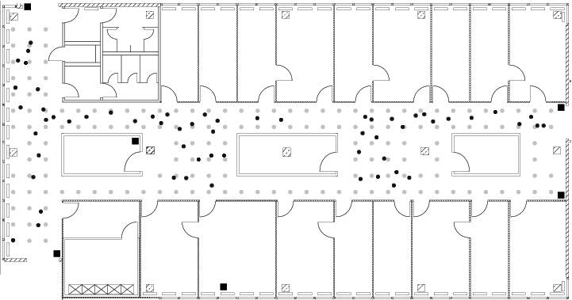

```{r , include=FALSE}
knitr::opts_chunk$set(echo = TRUE)
```
## Introduction 

The case study is about the precition of handheld device location based on its signal strength 

The data is provided in followin format  : 



There are 6 points where data is recorded from 166 different locations. on each location 


### Data 


```{r }
source("case_study_functions.R", echo = T, prompt.echo = "", spaced = F)
```


```{r}

txt = readLines("/Users/pankaj/dev/git/smu/qtw/class1/data/offline.final.trace.txt")

```

```{r}
length(txt)

strsplit(txt[4], ";")[[1]]


```

```{r}
unlist(lapply(strsplit(txt[4], ";")[[1]],
              function(x)
                sapply(strsplit(x, "=")[[1]], strsplit, ",")))

```


*** As we can see there are 151392 total records.

#### Explore orientation 

```{r}
lines = txt[ substr(txt, 1, 1) != "#" ]
tmp = lapply(lines, processLine)
offline = as.data.frame(do.call("rbind", tmp),stringsAsFactors = FALSE)
names(offline) = c("time", "scanMac", "posX", "posY", "posZ",
                   "orientation", "mac", "signal",
                   "channel", "type")
numVars = c("time", "posX", "posY", "posZ",
            "orientation", "signal")


offline[ numVars ] = lapply(offline[ numVars ], as.numeric)

offline = offline[ offline$type == "3", ]
offline = offline[ , "type" != names(offline) ]
dim(offline)


offline$rawTime = offline$time
offline$time = offline$time/1000
class(offline$time) = c("POSIXt", "POSIXct")
offline = offline[ , !(names(offline) %in% c("scanMac", "posZ"))]

length(unique(offline$orientation))
## [1] 203
plot(ecdf(offline$orientation))

```

#### Fix orientation 
We ll use following code to slab orientations in 8 discrete values

```{r}

offline$angle = roundOrientation(offline$orientation)

with(offline, boxplot(orientation ~ angle,
                      xlab = "nearest 45 degree angle",
                      ylab="orientation"))

c(length(unique(offline$mac)), length(unique(offline$channel)))


```


#### Explore location count 


```{r  location_count}
tokens = strsplit(txt[4], "[;=,]")[[1]]

tokens[1:10]

tokens[c(2, 4, 6:8, 10)]

tmp = matrix(tokens[ - (1:10) ], ncol = 4, byrow = TRUE)
mat = cbind(matrix(tokens[c(2, 4, 6:8, 10)], nrow = nrow(tmp),
                   ncol = 6, byrow = TRUE),
            tmp)
 


```


#### Exploring macs 

```{r}

table(offline$mac)

```

We ll include only first 7 macs (explain why)

```{r}
subMacs = names(sort(table(offline$mac), decreasing = TRUE))[1:7]
offline = offline[ offline$mac %in% subMacs, ]
```

#### Explore Channels 

```{r}

macChannel = with(offline, table(mac, channel))
apply(macChannel, 1, function(x) sum(x > 0))
```

We can drop channels since they don't provide any additional information and there is one to one relation between mac and channel 

```{r}
offline = offline[ , "channel" != names(offline)]
 
```

#### Exploring location count 

```{r}
locDF = with(offline,
             by(offline, list(posX, posY), function(x) x))
length(locDF)

sum(sapply(locDF, is.null))
locDF = locDF[ !sapply(locDF, is.null) ]

length(locDF)

locCounts = sapply(locDF, nrow)

locCounts = sapply(locDF,
                   function(df)
                     c(df[1, c("posX", "posY")], count = nrow(df)))


class(locCounts)
 dim(locCounts)
 locCounts[ , 1:8]


 locCounts = t(locCounts)
 plot(locCounts, type = "n", xlab = "", ylab = "")
 
 
 
 text(locCounts, labels = locCounts[,3], cex = .8, srt = 45)
```


#### Read processed data 

We define function readData using above findings to collect offline data and we create two filtered datasets by excluding one mac from each that are at same location 

```{r}

offline_file_path = "/Users/pankaj/dev/git/smu/qtw/class1/data/offline.final.trace.txt"
online_file_path = "/Users/pankaj/dev/git/smu/qtw/class1/data/online.final.trace.txt"

offline = readData(offline_file_path)

offline$posXY = paste(offline$posX, offline$posY, sep = "-")
 
 offlineSummary = createSummary(offline)
 
  subMacs = names(sort(table(offline$mac), decreasing = TRUE))[1:7]
  
 offlineSummary_without_cd = subset(offlineSummary, mac != subMacs[2])
 
 offlineSummary_without_c0 = subset(offlineSummary, mac != subMacs[1])
 
```

##  Methods 

We ll do analysis of 


###  EDA 

####  Explore macid signal at different angels

```{r}

 bwplot(signal ~ factor(angle) | mac, data = offline,
        subset = posX == 2 & posY == 12
        & mac != "00:0f:a3:39:dd:cd", xlab = "angles ",
        layout = c(2,3))
 
 summary(offline$signal)

```

#### Signal density at different angels 

```{r}

 densityplot( ~ signal | mac + factor(angle), data = offline,
              subset = posX == 24 & posY == 4 &
                mac != "00:0f:a3:39:dd:cd",
              bw = 0.5, plot.points = FALSE)
 
 offline$posXY = paste(offline$posX, offline$posY, sep = "-")
```


```{r}

 byLocAngleAP = with(offline,
                     by(offline, list(posXY, angle, mac),
                        function(x) x))
 # Then we can calculate summary statistics on each of these data frames with
 signalSummary =
   lapply(byLocAngleAP,
          function(oneLoc) {
            ans = oneLoc[1, ]
            ans$medSignal = median(oneLoc$signal)
            ans$avgSignal = mean(oneLoc$signal)
            ans$num = length(oneLoc$signal)
            ans$sdSignal = sd(oneLoc$signal)
            ans$iqrSignal = IQR(oneLoc$signal)
            ans
          })
 offlineSummary = do.call("rbind", signalSummary)
 
 breaks = seq(-90, -30, by = 5)
 aa = bwplot(sdSignal ~ cut(avgSignal, breaks = breaks),
        data = offlineSummary,
        subset = mac != "00:0f:a3:39:dd:cd",
        xlab = "Mean Signal", ylab = "SD Signal")
 print(aa)
 
```

#### signal strengthe plot for one mac 

```{r}


 oneAPAngle = subset(offline, mac == subMacs[5] & angle == 0)
 
 oneAPAngle = subset(offlineSummary,
                     mac == subMacs[5] & angle == 0)
 
 
 smoothSS = Tps(oneAPAngle[, c("posX","posY")],
                oneAPAngle$avgSignal)

 
 vizSmooth = predictSurface(smoothSS)
 
 plot.surface(vizSmooth, type = "C")
 
 
 points(oneAPAngle$posX, oneAPAngle$posY, pch=19, cex = 0.5)
 
```

#### a
```{r}

 surfaceSS(data = offlineSummary, mac == subMacs[5] & angle == 0)

```

#### multiple 

```{r}
 parCur = par(mfrow = c(2,2), mar = rep(1, 4))
 
    mapply(surfaceSS, mac = subMacs[ rep(c(5, 1), each = 2) ],
          angle = rep(c(0, 135), 2),
          data = list(data = offlineSummary))
    
  par(parCur)
  
```


#### AP

```{r}

 offlineSummary = subset(offlineSummary, mac != subMacs[2])
 
  AP = matrix( c( 7.5, 6.3, 2.5, -.8, 12.8, -2.8,
                  1, 14, 33.5, 9.3, 33.5, 2.8),
               ncol = 2, byrow = TRUE,
               dimnames = list(subMacs[ -2 ], c("x", "y") ))

  AP
  
  diffs = offlineSummary[ , c("posX", "posY")] -
    AP[ offlineSummary$mac, ]

  
  offlineSummary$dist = sqrt(diffs[ , 1]^2 + diffs[ , 2]^2)
  xyplot(signal ~ dist | factor(mac) + factor(angle),
         data = offlineSummary, pch = 19, cex = 0.3,
         xlab ="distance")

  
```

##  Data preprocessing 

```{r}


```


##  Model 

### Knn with euclidean distance

#### with both macs included 

```{r}
macs = unique(offlineSummary$mac)
 
 online = readData(online_file_path, subMacs = macs)
 online$posXY = paste(online$posX, online$posY, sep = "-")
 onlineSummary = createOnlineSummary(online)
 
  actualXY = onlineSummary[ , c("posX", "posY")]
  predicted_locations = predict_online_locations(offlineSummary,onlineSummary)
plot(predicted_locations)

  calcError(predicted_locations,actualXY )

```


#### without C0


```{r}
macs = unique(offlineSummary_without_cd$mac)
 
 online = readData(online_file_path, subMacs = macs)
 online$posXY = paste(online$posX, online$posY, sep = "-")
 onlineSummary = createOnlineSummary(online)
 
  actualXY = onlineSummary[ , c("posX", "posY")]
  predicted_locations = predict_online_locations(offlineSummary_without_c0,onlineSummary)
plot(predicted_locations)

  calcError(predicted_locations,actualXY )

```


#### without CD 


```{r}
macs = unique(offlineSummary_without_cd$mac)
 
 online = readData(online_file_path, subMacs = macs)
 online$posXY = paste(online$posX, online$posY, sep = "-")
 onlineSummary = createOnlineSummary(online)
 
  actualXY = onlineSummary[ , c("posX", "posY")]
  predicted_locations = predict_online_locations(offlineSummary_without_cd, onlineSummary)
plot(predicted_locations)
  calcError(predicted_locations,actualXY )


```


### Knn with inverse square signal strength (weighted distance formula) 

#### without cd  
```{r}
macs = unique(offlineSummary_without_c0$mac)
 
 online = readData(online_file_path, subMacs = macs)
 online$posXY = paste(online$posX, online$posY, sep = "-")
 onlineSummary = createOnlineSummary(online)
 predicted_locations= predict_online_locations_weighted(offlineSummary_without_cd, onlineSummary)
  plot(predicted_locations)
  calcError(predicted_locations,actualXY )


```

#### without C0

```{r}

 macs = unique(offlineSummary_without_c0$mac)
 
 online = readData(online_file_path, subMacs = macs)
 online$posXY = paste(online$posX, online$posY, sep = "-")
 onlineSummary = createOnlineSummary(online)
 
  actualXY = onlineSummary[ , c("posX", "posY")]
  predicted_locations= predict_online_locations_weighted(offlineSummary_without_c0, onlineSummary)
  plot(predicted_locations)

    calcError(predicted_locations,actualXY )

 
```


#### with both macs included 

```{r}
 macs = unique(offlineSummary$mac)
 
 online = readData(online_file_path, subMacs = macs)
 online$posXY = paste(online$posX, online$posY, sep = "-")
 onlineSummary = createOnlineSummary(online)
 
  actualXY = onlineSummary[ , c("posX", "posY")]
 predicted_locations= predict_online_locations_weighted(offlineSummary, onlineSummary)
  plot(predicted_locations)
  calcError(predicted_locations,actualXY )

```


## Summary 


## Appendix 


```{r setup, include=FALSE}
knitr::opts_chunk$set(
    echo = TRUE,
    comment=NA)
```

## Example


### cross validation 
 

```{r}
  k_errors_cd = run_kkross_fold(offlineSummaryData = offlineSummary_without_cd )
  k_errors_c0 = run_kkross_fold(offlineSummaryData = offlineSummary_without_c0 )
  
```


```{r}

  
    plot(k_errors_cd, type = 'l')
    
   plot(k_errors_c0, type = 'l')
    
    
```

 